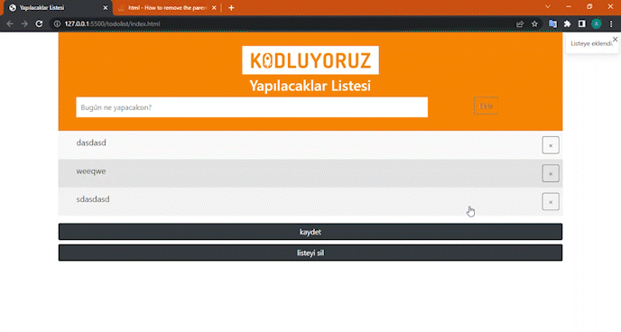

# TO DO LIST

## kodluyoruz patika.dev javascript 2. ödevi

---
### proje içi eğitim içeriği
* listeye eleman ekleme
* eleman silme
* listeyi tamamen silme
* localStorage kayıt ve geri getirme
* bootstrap toaster kullanımı
* js ile class ekleme ve seçilen elemanların görünümünü "checked" yapma
----
## eleman ekleme

---
## bütün elemanları silme

 
 ---
 ## tek eleman silme

 

 ---
 ## localStorage kayıt

 
